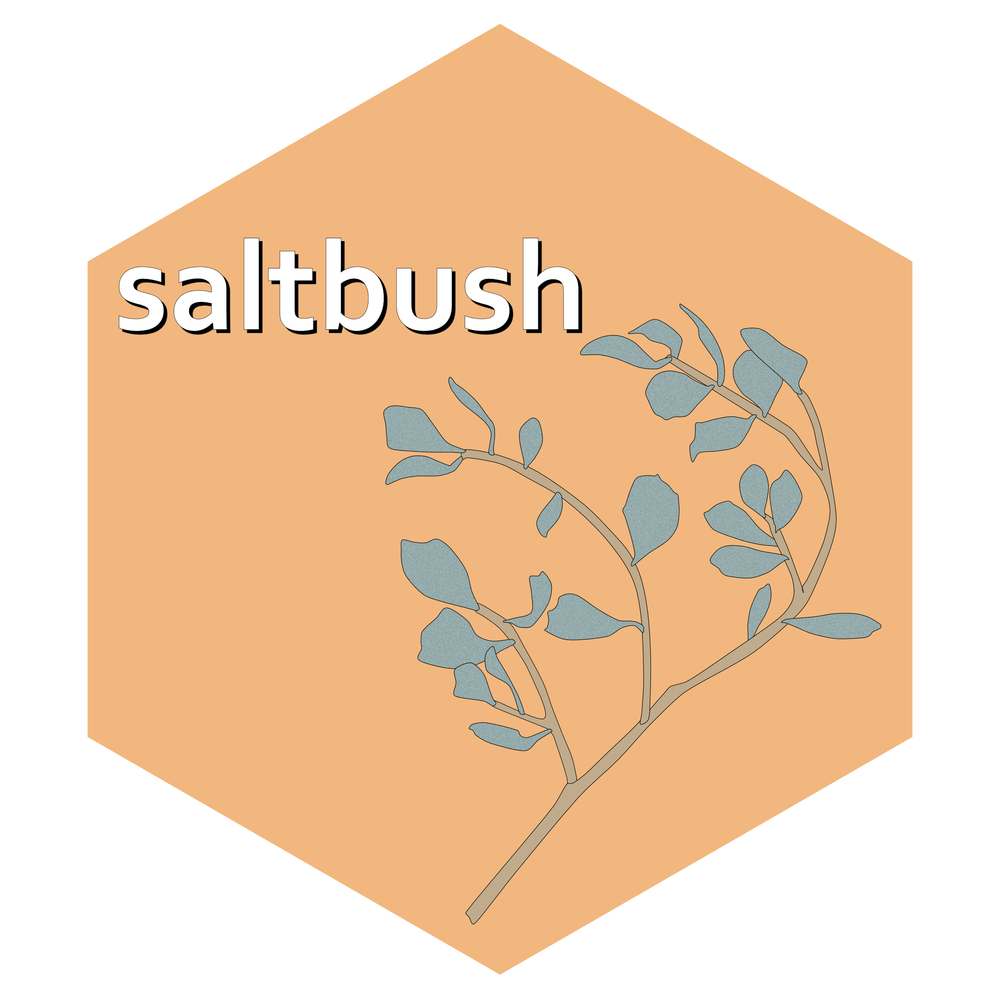

<!-- README.md is generated from README.Rmd. Please edit that file -->

```{r, include = FALSE}
knitr::opts_chunk$set(
  collapse = TRUE,
  comment = "#>",
  fig.path = "man/figures/README-",
  out.width = "90%"
)

library(saltbush)
```

<!-- badges: start -->
[](https://lifecycle.r-lib.org/articles/stages.html#experimental)
[](https://github.com/traitecoevo/saltbush/actions/workflows/R-CMD-check.yaml)
[](https://app.codecov.io/gh/traitecoevo/saltbush)
<!-- badges: end -->

# saltbush 

*saltbush* processes drone imagery to calculate spectral diversity values as part of the assessment of the 'spectral variability hypothesis' or the 'spectral-biodiversity relationship'. This was specifically implemented to connect *from-the-sky* diversity with *on-the-ground* diversity as measured in the AusPlots project. There are also functions to calculate on-the-ground diversity built on the [ausplotsR](https://github.com/ternaustralia/ausplotsR) and [vegan](https://github.com/vegandevs/vegan) packages.  The statistical methods for connecting diversity sampled on the ground to diversity sampled from the sky are still developing.  This package is aimed at making from-the-sky diversity methods development easier for researchers across the world.

Specifically we have used this package in a test in the Australian arid zone.  The results suggest that some of the methods below perform much better than others.  See our paper *Placeholder to link to the preprint once that's posted.*

## Installation

```{r install, eval = FALSE}
install.packages("remotes")
remotes::install_github("traitecoevo/saltbush", build_vignettes = TRUE)
```

## A quick taste

`saltbush` ships with a small synthetic dataset and a cached AusPlots query so you can try the on-the-ground side without any external data:

```{r quick-field}
field_diversity <- calculate_field_diversity(ausplots_NSABHC0009)
field_diversity$taxonomic_diversity
```

For the from-the-sky side, the package bundles five single-band drone TIFs you can stack and turn into spectral metrics:

```{r quick-spectral, message = FALSE, results = "hide"}
raster_files <- list.files(
  system.file("extdata/example", package = "saltbush"),
  pattern = "\\.tif$", full.names = TRUE
)
aoi_files <- list.files(
  system.file("extdata/aoi", package = "saltbush"),
  pattern = "NSABHC0009_aoi\\.shp$", full.names = TRUE
)
pixel_values <- extract_pixel_values(
  raster_files, aoi_files,
  c("blue", "green", "red", "red_edge", "nir")
)
metrics <- calculate_spectral_metrics(
  pixel_values,
  wavelengths = c("blue", "green", "red", "red_edge", "nir"),
  masked = FALSE, rarefaction = FALSE
)
```

```{r show-spectral}
metrics
```

## Worked example

For a full walkthrough — multiband-image construction, AOI extraction, spectral metrics, AusPlots point-intercept diversity, and how the two halves fit together — see the package vignette:

```{r vignette, eval = FALSE}
vignette("saltbush")
```

## Diversity metrics computed

**Spectral diversity** (from drone imagery):

- coefficient of variance (CV)
- spectral variance (SV)
- convex hull volume (CHV)

**Taxonomic diversity** (from point-intercept survey data):

- species richness
- Shannon's diversity index
- Simpson's diversity index
- Pielou's evenness
- exponential Shannon's index
- inverse Simpson's index

## Comparing from-the-sky and from-the-ground diversity

High-resolution drone images are very large, and the example data included with the package on GitHub are too small to do this meaningfully. We recommend running the workflow locally on your own imagery following the steps in `vignette("saltbush")`.
