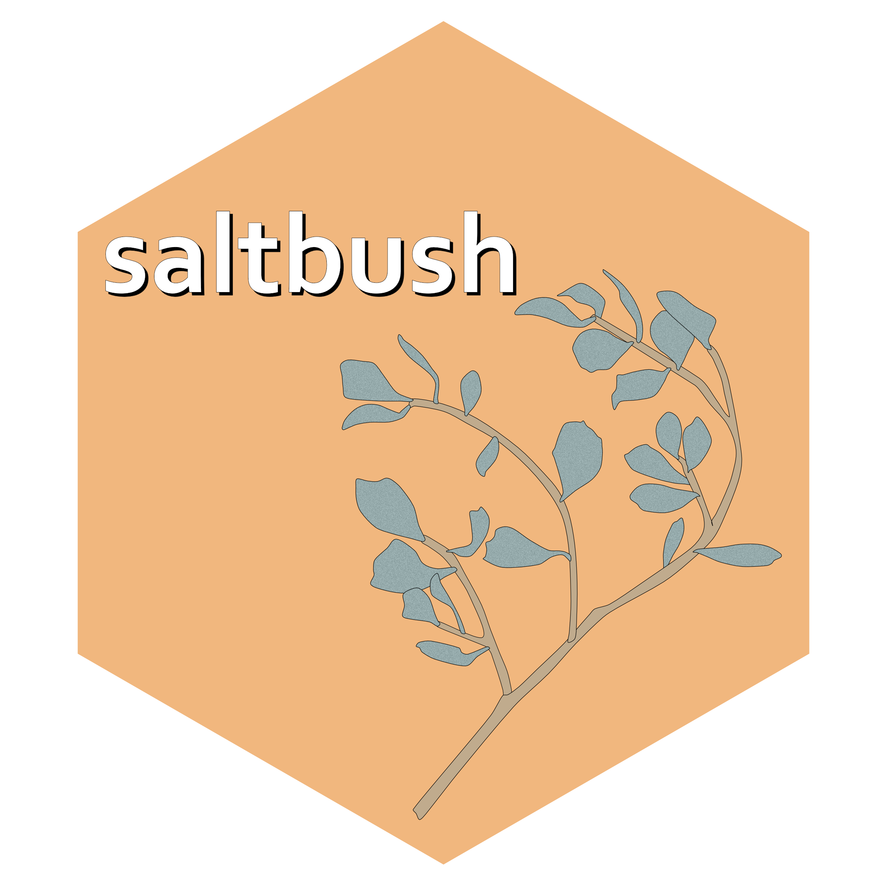

<!-- README.md is generated from README.Rmd. Please edit that file -->

```{r, include = FALSE}
knitr::opts_chunk$set(
  collapse = TRUE,
  comment = "#>",
  fig.path = "man/figures/README-",
  out.width = "90%"
)

library(saltbush)
```

<!-- badges: start -->
[](https://lifecycle.r-lib.org/articles/stages.html#experimental)
[](https://github.com/traitecoevo/saltbush/actions/workflows/R-CMD-check.yaml)
[](https://app.codecov.io/gh/traitecoevo/saltbush)
<!-- badges: end -->

# saltbush 

*saltbush* processes drone imagery to calculate spectral diversity values as part of the assessment of the 'spectral variability hypothesis' or the 'spectral-biodiversity relationship'. This was specifically implemented to connect with on-the-ground diversity as measured in the AusPlots project, so there are also functions to calculate on-the-ground diversity built on the [ausplotsR](https://github.com/ternaustralia/ausplotsR) and [vegan](https://github.com/vegandevs/vegan) packages.  The statistical methods for connecting diversity sampled on the ground to diversity sampled from the sky are still developing.  This package is aimed at making this methods development easier for researchers across the world. 

Specifically we have used this package in a test in the Australian arid zone.  The results suggest that some of the methods below perform much better than others.  See our paper *Placeholder to link to the preprint once that's posted.*

## Installation

```{r install, eval= FALSE}
 install.packages("remotes")
 remotes::install_github("traitecoevo/saltbush")
```

## Usage

1. **Direct the package to the input files** in this case we use a drone image from Fowlers Gap, NSW, Australia

the example data in this case is 5 bands sampled from a drone
```{r, message=FALSE, results='hide'}
create_multiband_image("inst/extdata/create_multiband_image/",
                       c('blue', 'green', 'red', 'red_edge', 'nir'), 
                       output_dir = tempdir(),
                       make_plot = TRUE, return_raster = TRUE)
```


this can be combined with an area of interest mask:

```{r}

raster_files <- list.files("inst/extdata/example",
    pattern = '.tif$', full.names = TRUE)

aoi_files <- list.files("inst/extdata/aoi",
    pattern = 'NSABHC0009_aoi.shp$', full.names = TRUE)


```

2. **Extract pixel values** from the area of interest in the image

```{r}

pixel_values <- extract_pixel_values(raster_files, 
                                     aoi_files)

head(pixel_values)  

```

3. **Calculate spectral metrics** 
```{r}

metrics <- calculate_spectral_metrics(pixel_values, 
                                      masked = F, 
                                      wavelengths = colnames(pixel_values[, 2:6]), 
                                      rarefaction = F)

head(metrics)

```

+ co-efficient of variance (CV)
+ spectral variance (SV)
+ convex hull volume (CHV)

For a full discussion of this metrics see the manuscript  

4. **Download plot data** from AusPlots. The `veg.PI` part extracts the point intercept data from the AusPlots data structure. In this case we use the same AusplotID as in the drone images above. This gets us data for two on-the-ground sampling visits to one particular AusPlot where we happen to have drone imagery. 

```{r, message=FALSE}
my.data <- ausplotsR::get_ausplots(my.Plot_IDs=c("NSABHC0009"), veg.PI=TRUE)
my.data$site.info$visit_date
```


5. **Calculate on-the-ground diversity** from the point intercepts using different diversity metrics. The output is a list which includes taxonomic metrics, and also community matrices for checks.  Not that this takes the `PI` part of the AusPlot object which stands for point-intercept. For a general function to calculate on-the-ground diversity, see [the diversity function from the vegan package](https://rdrr.io/cran/vegan/man/diversity.html).  

```{r}
field_diversity <- calculate_field_diversity(my.data$veg.PI)
field_diversity$taxonomic_diversity
```

2012 was wetter than 2016 and there are a number of rain ephemeral species at this site so the higher species richness makes sense.  

the calculated diversity metrics are:

+ species richness
+ shannon's diversity index
+ simpson's diversity index
+ pielou's evenness
+ exponential shannon's index
+ inverse simpson's index

